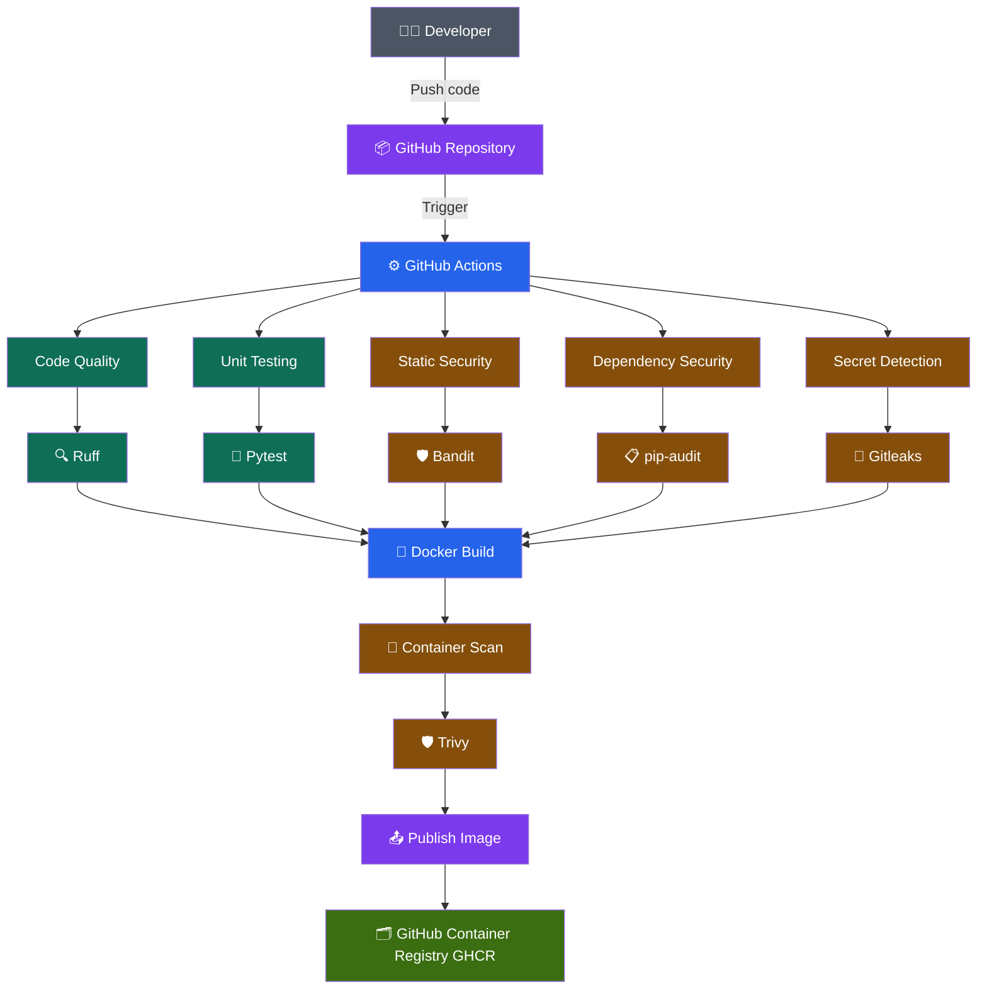
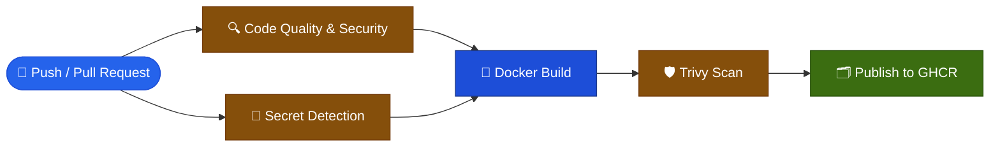
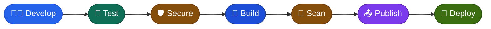
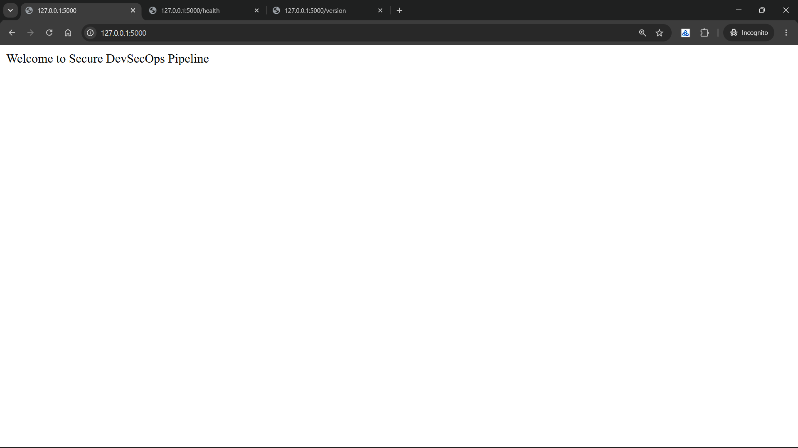
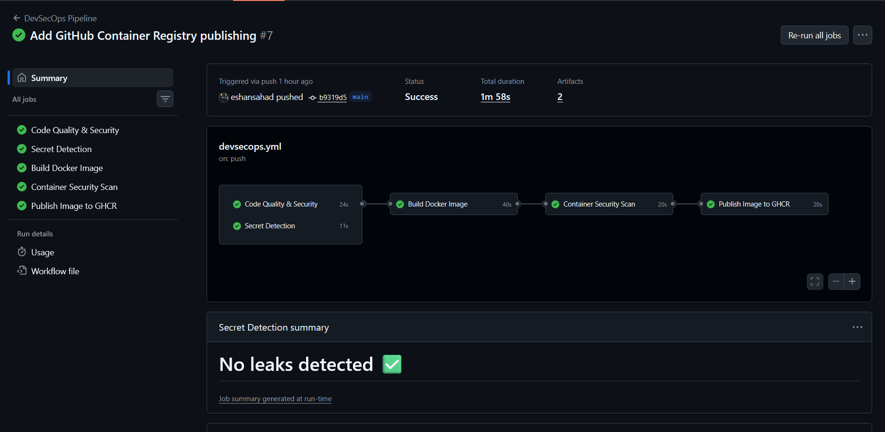
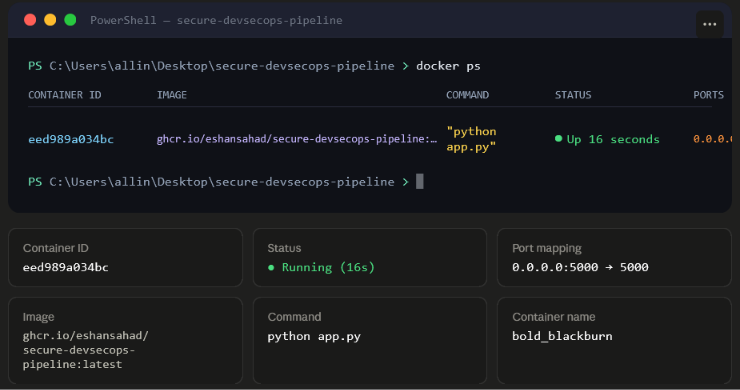
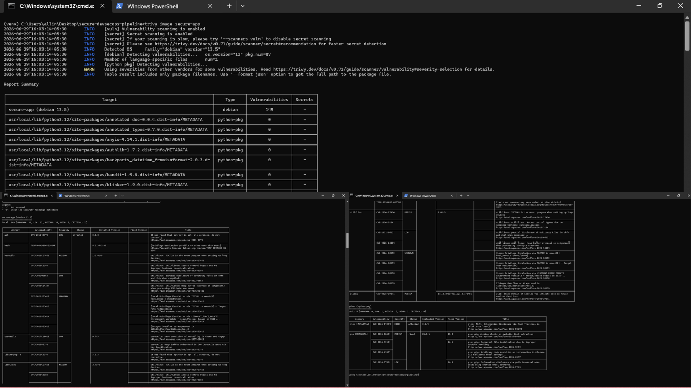
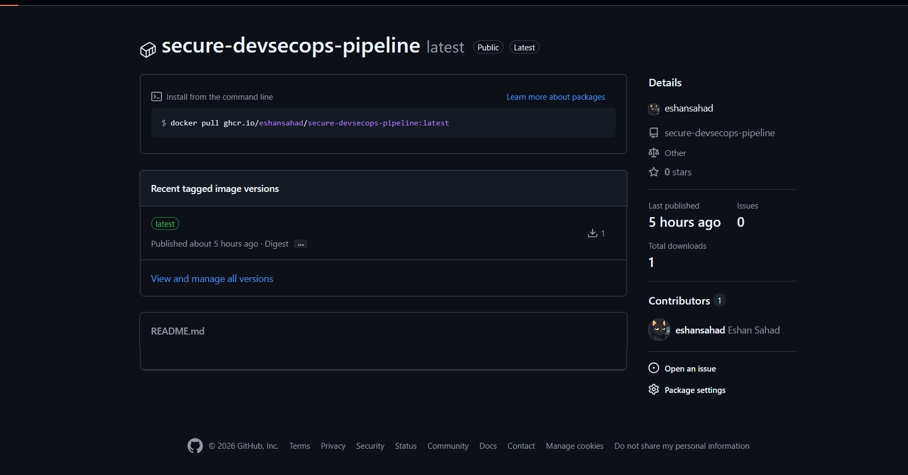

# 🛡️ Secure DevSecOps Pipeline

<p align="center">


</p>

---

## 📖 Project Overview

**Secure DevSecOps Pipeline** is an end-to-end DevSecOps project demonstrating secure software development practices using Python, Flask, Docker, GitHub Actions, and modern security tools.

The project implements a complete Continuous Integration (CI) pipeline where every code change is automatically:

* Checked for code quality
* Tested with unit tests
* Scanned for security vulnerabilities
* Scanned for exposed secrets
* Built into a Docker image
* Scanned for container vulnerabilities
* Published to GitHub Container Registry (GHCR)

The primary goal of this project is to demonstrate **Shift-Left Security**, where security is integrated throughout the Software Development Life Cycle (SDLC) rather than being performed only before deployment.

---

## 💡 Why This Project?

Modern software development requires security to be integrated throughout the development lifecycle rather than treated as a final step. This project demonstrates how DevSecOps practices can be implemented in a real-world Python application by automating code quality checks, testing, vulnerability scanning, secret detection, container security, and image publishing using GitHub Actions.

The primary objective is to showcase a practical implementation of **Shift-Left Security**, ensuring that every code change is verified before reaching production.

---

## 📑 Table of Contents

- [Project Overview](#-project-overview)
- [Objectives](#-objectives)
- [Features](#-features)
- [Technology Stack](#-technology-stack)
- [Project Structure](#-project-structure)
- [Project Architecture](#-project-architecture)
- [DevSecOps Lifecycle](#-devsecops-lifecycle)
- [Getting Started](#-getting-started)
- [Running with Docker](#-running-with-docker)
- [Running with Docker Compose](#-running-with-docker-compose)
- [Running Tests](#-running-tests)
- [Security Scans](#-security-scans)
- [CI/CD Pipeline](#️-cicd-pipeline)
- [Project Demonstration](#-project-demonstration)
- [Project Outcomes](#-project-outcomes)
- [Lessons Learned](#-lessons-learned)
- [Future Improvements](#-future-improvements)
- [Author](#-author)
- [License](#-license)

---

## 🎯 Objectives

* Learn modern DevSecOps practices
* Implement automated CI/CD pipelines
* Integrate multiple security scanning tools
* Build and publish Docker images automatically
* Demonstrate secure software delivery using GitHub Actions

## ✨ Features

| Feature                                        | Description                                                                             |
| ---------------------------------------------- | --------------------------------------------------------------------------------------- |
| 🚀 Automated CI Pipeline                       | Every push or pull request automatically triggers the complete DevSecOps workflow.      |
| 🧪 Unit Testing                                | Automated testing using **Pytest** ensures application functionality before deployment. |
| 🔍 Code Quality Analysis                       | **Ruff** checks Python code for style issues, errors, and best practices.               |
| 🛡️ Static Application Security Testing (SAST) | **Bandit** scans the source code for common security vulnerabilities.                   |
| 📦 Dependency Vulnerability Scanning           | **pip-audit** identifies known vulnerabilities in Python dependencies.                  |
| 🔑 Secret Detection                            | **Gitleaks** prevents accidental exposure of API keys, passwords, and secrets.          |
| 🐳 Docker Containerization                     | The application is packaged into a lightweight Docker container for portability.        |
| 🔎 Container Security Scanning                 | **Trivy** scans Docker images for operating system and package vulnerabilities.         |
| 📤 GitHub Container Registry (GHCR)            | Successfully scanned Docker images are automatically published to GHCR.                 |
| ⚡ Multi-Job GitHub Actions Workflow            | Independent jobs improve maintainability and parallel execution of security checks.     |

---

## 🛠️ Technology Stack

| Category             | Technology                       |
| -------------------- | -------------------------------- |
| Programming Language | Python 3.10                      |
| Web Framework        | Flask                            |
| Containerization     | Docker                           |
| Container Registry   | GitHub Container Registry (GHCR) |
| CI/CD                | GitHub Actions                   |
| Unit Testing         | Pytest                           |
| Linting              | Ruff                             |
| SAST                 | Bandit                           |
| Dependency Scanning  | pip-audit                        |
| Secret Scanning      | Gitleaks                         |
| Container Security   | Trivy                            |
| Version Control      | Git & GitHub                     |

---

## 🐍 Python Compatibility

| Python Version | Status |
|---------------|--------|
| 3.10 | ✅ Fully Tested |
| 3.11 | ✅ Compatible |
| 3.12 | ⚠️ Expected to Work |


## 📂 Project Structure

```text
secure-devsecops-pipeline/
│
├── .github/
│   └── workflows/
│       └── devsecops.yml
│
├── app/
│   ├── __init__.py
│   └── app.py
│
├── tests/
│   └── test_app.py
│
├── docs/
│   └── screenshots/
│       ├── docker-running.png
│       ├── ghcr-package.png
│       ├── github-actions-success.png
│       ├── home-page.png
│       └── trivy-scan.png
│
├── security/
│   ├── bandit-report.json
│   ├── pip-audit-report.txt
│   └── trivy-report.txt
│
├── Dockerfile
├── docker-compose.yml
├── requirements.txt
├── .gitignore
├── LICENSE
└── README.md


## 🏗️ Project Architecture
```


## 📋 Pipeline Execution Timeline

```text
Developer Push / Pull Request
            │
            ▼
GitHub Actions Workflow
            │
            ▼
Ruff (Linting)
            │
            ▼
Pytest (Unit Tests)
            │
            ▼
Bandit (SAST)
            │
            ▼
pip-audit (Dependency Scan)
            │
            ▼
Gitleaks (Secret Detection)
            │
            ▼
Docker Image Build
            │
            ▼
Trivy (Container Scan)
            │
            ▼
Publish to GitHub Container Registry (GHCR)
```



## 🔐 DevSecOps Lifecycle



> ⚡ **Shift-Left Security** — This project integrates security checks early in the
> software development lifecycle, rather than performing them only before deployment.

## 🚀 Getting Started

### Prerequisites

Before running the project, ensure the following tools are installed:

* Python 3.10 or later
* Docker Desktop
* Git
* GitHub Account (for CI/CD)

---

## 📥 Clone the Repository

```bash
git clone https://github.com/eshansahad/secure-devsecops-pipeline.git
cd secure-devsecops-pipeline
```

---

## 🐍 Create a Virtual Environment

### Windows

```bash
python -m venv venv
venv\Scripts\activate
```

### Linux/macOS

```bash
python3 -m venv venv
source venv/bin/activate
```

---

## 📦 Install Dependencies

```bash
pip install -r requirements.txt
```

---

## ▶️ Run the Flask Application

```bash
python app/app.py
```

The application will be available at:

```text
http://localhost:5000
```

Available endpoints:

| Endpoint   | Description           |
| ---------- | --------------------- |
| `/`        | Home page             |
| `/health`  | Health check endpoint |
| `/version` | Application version   |

---

# 🐳 Running with Docker

Build the Docker image:

```bash
docker build -t secure-app .
```

Run the container:

```bash
docker run -p 5000:5000 secure-app
```

---

# 🐳 Running with Docker Compose

Build and start the application:

```bash
docker compose up --build
```

Stop the application:

```bash
docker compose down
```

---

# 🧪 Running Tests

Execute all unit tests:

```bash
python -m pytest
```

---

# 🔒 Security Scans

Run Ruff:

```bash
python -m ruff check .
```

Run Bandit:

```bash
python -m bandit -r app
```

Run Dependency Scan:

```bash
pip-audit
```

Run Trivy Scan:

```bash
trivy image secure-app
```

---

# 📦 Pull Image from GitHub Container Registry

Pull the latest published Docker image:

```bash
docker pull ghcr.io/eshansahad/secure-devsecops-pipeline:latest
```

Run the published image:

```bash
docker run -p 5000:5000 ghcr.io/eshansahad/secure-devsecops-pipeline:latest
```

---

# 🚀 Deployment

The application is containerized using Docker and can be deployed to any OCI-compatible container platform.

### Current Deployment Target

- GitHub Container Registry (GHCR)

### Future Deployment Targets

- Azure Container Apps
- Azure Kubernetes Service (AKS)
- Docker Swarm
- Kubernetes Clusters
- Amazon ECS
- Google Cloud Run

Deployment will be automated in future versions using Infrastructure as Code (Terraform) and GitOps workflows.

---

## ⚙️ CI/CD Pipeline

This project uses **GitHub Actions** to automate testing, security scanning, containerization, and image publishing. Every push or pull request triggers the pipeline, ensuring that only verified and secure code progresses through the build process.

### Pipeline Stages

| Stage               | Tool                      | Purpose                                                         |
| ------------------- | ------------------------- | --------------------------------------------------------------- |
| Code Quality        | Ruff                      | Checks Python code quality and style issues                     |
| Unit Testing        | Pytest                    | Validates application functionality                             |
| Static Security     | Bandit                    | Detects common Python security vulnerabilities (SAST)           |
| Dependency Security | pip-audit                 | Scans Python dependencies for known CVEs                        |
| Secret Detection    | Gitleaks                  | Detects API keys, passwords, and secrets accidentally committed |
| Docker Build        | Docker                    | Builds a production-ready container image                       |
| Container Security  | Trivy                     | Scans the Docker image for OS and package vulnerabilities       |
| Image Publishing    | GitHub Container Registry | Publishes the verified image to GHCR                            |

---

## 🔄 Pipeline Flow

```mermaid
flowchart TD

    A([👨‍💻 Developer Push]) --> B([⚙️ GitHub Actions])

    B --> C[🔍 Code Quality & Security]
    B --> D[🔐 Secret Detection]

    C --> C1([✅ Ruff])
    C --> C2([🧪 Pytest])
    C --> C3([🛡️ Bandit])
    C --> C4([📋 pip-audit])

    D --> D1([🔑 Gitleaks])

    C1 & C2 & C3 & C4 & D1 --> E([🐳 Docker Build])

    E --> F[🔬 Container Security]
    F --> F1([🛡️ Trivy])
    F1 --> G([📤 Publish Docker Image])
    G --> H([🗂️ GitHub Container Registry])

    style A fill:#4B5563,color:#fff,stroke:#374151
    style B fill:#2563EB,color:#fff,stroke:#1D4ED8

    style C fill:#854F0B,color:#fff,stroke:#713808
    style C1 fill:#0F6E56,color:#fff,stroke:#085041
    style C2 fill:#0F6E56,color:#fff,stroke:#085041
    style C3 fill:#854F0B,color:#fff,stroke:#713808
    style C4 fill:#854F0B,color:#fff,stroke:#713808

    style D fill:#854F0B,color:#fff,stroke:#713808
    style D1 fill:#854F0B,color:#fff,stroke:#713808

    style E fill:#1D4ED8,color:#fff,stroke:#1E3A8A
    style F fill:#854F0B,color:#fff,stroke:#713808
    style F1 fill:#854F0B,color:#fff,stroke:#713808
    style G fill:#7C3AED,color:#fff,stroke:#5B21B6
    style H fill:#3B6D11,color:#fff,stroke:#27500A
```


---

## 📦 Workflow Jobs

The workflow is divided into independent jobs for better maintainability and faster troubleshooting.

### 1. Code Quality & Security

Responsible for:

* Python linting using Ruff
* Unit testing using Pytest
* Static Application Security Testing using Bandit
* Dependency vulnerability scanning using pip-audit

---

### 2. Secret Detection

Uses **Gitleaks** to scan the repository for accidentally committed:

* API Keys
* Passwords
* Tokens
* Certificates
* Private Keys

---

### 3. Docker Build

* Builds the Docker image
* Saves the image as an artifact
* Uploads the artifact for downstream jobs

---

### 4. Container Security

Downloads the Docker image artifact and scans it using **Trivy** to detect vulnerabilities in:

* Operating system packages
* Installed libraries
* Base image components

---

### 5. Publish to GitHub Container Registry

After all quality and security checks pass, the verified Docker image is automatically published to **GitHub Container Registry (GHCR)**.

---

## 🛡️ Security-First Approach

This project follows the **Shift-Left Security** principle by integrating security checks early in the development lifecycle.

Every code change is automatically:

* Linted
* Tested
* Security scanned
* Secret scanned
* Container scanned

before being published.

This reduces the risk of introducing vulnerabilities into production environments.

## 📸 Project Demonstration

### Application Running

> The Flask application running locally inside a Docker container.



---

### GitHub Actions Pipeline

> Successful execution of the multi-stage DevSecOps pipeline.



---

### Docker Container

> Running Docker container exposing the application on port **5000**.



---

### Trivy Security Scan

> Container vulnerability scan completed successfully.



---

### GitHub Container Registry

> Docker image successfully published to GitHub Container Registry.



---

# 📈 Project Outcomes

This project demonstrates practical implementation of modern DevSecOps practices.

### Implemented Features

* ✅ Flask Web Application
* ✅ Docker Containerization
* ✅ Docker Compose
* ✅ GitHub Actions CI/CD
* ✅ Ruff Code Quality Analysis
* ✅ Pytest Unit Testing
* ✅ Bandit Static Security Testing
* ✅ pip-audit Dependency Scanning
* ✅ Gitleaks Secret Detection
* ✅ Trivy Container Security Scanning
* ✅ GitHub Container Registry Publishing
* ✅ Multi-job GitHub Actions Workflow

---

# 📚 Lessons Learned

Through this project, I gained hands-on experience with:

* Building and containerizing Python applications
* Writing automated unit tests
* Integrating security into the software development lifecycle
* Implementing Shift-Left Security principles
* Designing multi-stage GitHub Actions workflows
* Managing Docker image artifacts across workflow jobs
* Publishing secure container images to GitHub Container Registry
* Applying DevSecOps best practices in a practical project

---

# 🚀 Future Improvements

Planned enhancements include:

* Deploy to Azure Container Apps
* Deploy to Azure Kubernetes Service (AKS)
* Infrastructure provisioning using Terraform
* Kubernetes deployment manifests
* Helm charts
* SonarQube integration
* SBOM generation using Syft
* Image signing with Cosign
* GitOps deployment using Argo CD
* Monitoring with Prometheus & Grafana

---

# 👨‍💻 Author

**Eshan Sahad**

Computer Engineering Student | Cloud & DevSecOps Enthusiast

GitHub:
https://github.com/eshansahad

---

# 📄 License

This project is licensed under the MIT License.

Feel free to fork, learn, and build upon this project.
